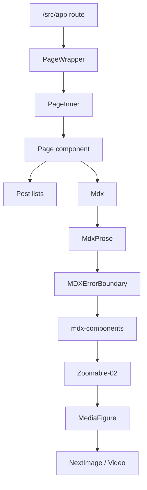

# Repo guide + architecture

## Purpose

- Quick start for dev and content workflows.
- Architecture dock: the main composition and data flow map.
- Primary architecture reference for `docs/INDEX.md`.

## Commands

- `bun dev` - Start development server with Turbopack
- `bun build` - Build for production
- `bun start` - Start production server
- `bun lint` - Run Next.js linting
- `bun create-post` - Create a new blog post with interactive prompts (reads template from `.cursor/skills/create-post/`)
- `bun organize-posts` - Move root posts into category folders
- `bun check-posts` - Fail if posts are out of place

## Tech stack

- Next.js 15 with App Router and Turbopack
- TypeScript with strict mode
- TailwindCSS v4 with custom theme configuration
- Content Collections for type-safe MDX content management
- Shadcn/UI components built on Radix UI
- Framer Motion for animations

## Directory structure

- `/src/app` - Next.js app router pages and layouts
- `/src/components` - Atomic design pattern:
  - `/atoms` - Base components (Button, Text, Link, SVG)
  - `/card` - Card components for content display
  - `/elements` - Composite UI elements
  - `/page` - Page-level components
  - `/mdx` - MDX-specific components
- `/posts` - MDX content files for blog posts
- `/src/types` - TypeScript type definitions
- `/src/lib` - Utility functions and configurations

## Architecture map (composition)

### Layout stack

- `PageWrapper` owns global page chrome (Nav + Footer + share node).
- `PageInner` owns in-page spacing and variants (`post`, `index`, `log`, `home`).
- Most pages: `PageWrapper` -> `PageInner` -> page-specific component.

### Diagram (high-level)

### Content pipeline

- Source: MDX in `/posts`.
- Schema: `content-collections.ts` defines the canonical types.
- Runtime: `allPosts` (and helpers) feed pages and lists.

### MDX render flow

- `Mdx` wraps `MdxProse` + `MDXErrorBoundary`.
- `mdx-components` is zero-styling mapping and logic only.
- Media in MDX uses `ZoomableImage` / `ZoomableVideo`:
  `Zoomable-02` -> `MediaFigure` -> `NextImage` or `Video`.

### Media system (canonical)

- Only supported zoom implementation: `src/components/media/zoomable-02.tsx`.
- Legacy zoomables are archived under `src/components/media/legacy/` and should not be imported.
- Media styling uses `MediaWrapper` + `MediaFigure` + `media-utils` aspect helpers.

### Client boundaries (intent)

- Server-first pages, small client islands for interactivity.
- Client-only areas: navigation scroll state, sort/filter lists, share/download/copy actions,
  zoom/scroll interactions (`ZoomCarousel`, gallery grids).

#### Client islands (current)

| Component                                               | Why client               | Notes                                       |
| ------------------------------------------------------- | ------------------------ | ------------------------------------------- |
| `src/components/page/nav.tsx`                           | scroll + route state     | `usePathname`, `useWindowScroll`.           |
| `src/components/page/posts-index-or-featured.tsx`       | sorting UI               | local state + router query.                 |
| `src/components/page/posts-index-or-full.tsx`           | view mode toggle         | URL param sync + scroll.                    |
| `src/components/post/list/posts-list-grouped.tsx`       | grouped toggle           | uses `useMemo` and client rendering.        |
| `src/components/elements/share-button.tsx`              | Web Share API            | client-only API.                            |
| `src/components/elements/download-button.tsx`           | client actions           | download triggers.                          |
| `src/components/elements/copy-button.tsx`               | clipboard                | client-only API.                            |
| `src/app/(home)/home-folio-client.tsx`                  | folio zoom state         | isolates `BodyClassProvider` + click state. |
| `src/app/(home)/zoom-carousel.tsx`                      | animation + DOM measures | Framer + layout effects.                    |
| `src/app/gallery/(components)/gallery-posts-client.tsx` | hover + filter state     | isolates `GalleryPosts`.                    |

## Content architecture

All content is managed through MDX files with Content Collections. The schema is defined in `content-collections.ts` and provides:

- Type-safe frontmatter validation
- Automatic type generation
- Git-based last modified timestamps
- Reading time calculation
- Asset management with dimensions

## Content taxonomy

- Posts live in `/posts` as MDX.
- Category (domain): `writing`, `projects`, `notes`, `page`
- Type (format): `post`, `page`, `link`, `index`
- Log is a view (writing + projects + notes), not a category.
- About + Letters are pages (`category: page`, `type: page`).
- `link` is for outward‑pointing posts with minimal body.
- Post files must live under `/posts/{writing,projects,notes,pages}`.

## Environment and deployment

- Deployed on Vercel
- Uses Bunny.net CDN for video hosting
- Analytics via Plausible
- OpenGraph image generation configured
